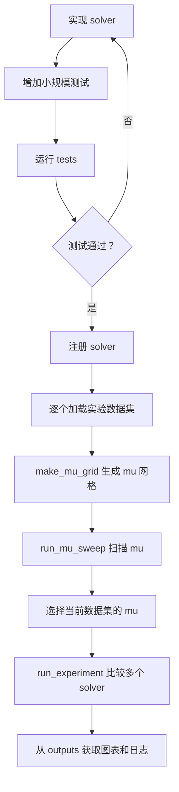

# LASSO 多算法优化课程展示

项目目标是手写并比较：

- Subgradient
- ISTA
- FISTA
- Coordinate Descent
- ADMM

统一求解：

\[
\min_x \frac{1}{2}\|Ax-b\|_2^2+\mu\|x\|_1
\]

## 当前状态

模块 A 已完成：

- 合成数据生成、Diabetes 预处理和 E2006 子集预处理入口。
- 公共数学函数、统一指标、绘图和 CSV 导出。
- solver 返回格式及接口校验。
- 单个 `mu` 的算法比较流程。
- 多个 `mu` 的网格扫描流程。
- 模块 B、C 的算法目录和测试框架。

五个正式 solver 尚未实现。

```text
src/lasso_demo/algorithms/
├── module_b/       # Subgradient、ISTA、FISTA
└── module_c/       # Coordinate Descent、ADMM
```

算法核心必须手写迭代，不能调用现成 LASSO 或通用优化求解器代替。

## 开发流程



后续开发同学需要完成的工作就是：

1. 实现 solver。
2. 在小数据上测试。
3. 在多个数据集上扫描 `mu`。
4. 固定当前数据集的 `mu`，比较五种算法。
5. 汇总 `outputs/` 中的结果。

## 安装与数据

```powershell
python -m venv .venv
.\.venv\Scripts\Activate.ps1
python -m pip install --upgrade pip
python -m pip install -e .
python -m experiments.prepare_data
```

已生成的数据位于：

```text
data/processed/
├── synthetic/
│   ├── synthetic_small.npz          # 开发测试
│   ├── synthetic_demo.npz           # 合成主实验
│   ├── synthetic_corr_*.npz         # 相关性实验
│   ├── synthetic_noise_*.npz        # 噪声实验
│   └── synthetic_stress.npz         # 规模拓展
└── diabetes/
    └── diabetes.npz                 # 训练/验证/测试
```

仓库已经提供处理后的 E2006 子集：

```text
data/processed/e2006/e2006_subset.npz
```

原始文件体积较大，不上传到 GitHub。只有需要重新生成 E2006 子集时才下载：

- [E2006.train.bz2](https://www.csie.ntu.edu.tw/~cjlin/libsvmtools/datasets/regression/E2006.train.bz2)
- [E2006.test.bz2](https://www.csie.ntu.edu.tw/~cjlin/libsvmtools/datasets/regression/E2006.test.bz2)

共约 221.7 MiB，放入 `data/raw/e2006/`，然后运行：

```powershell
python -m experiments.prepare_data --prepare-e2006
```

## 实现 Solver

统一接口：

```python
def solver(A, b, mu, config):
    ...
    return {"x": x, "history": history}
```

建议使用：

```python
from lasso_demo.core import create_history, record_history
```

基本结构：

```python
def solver(A, b, mu, config):
    x = np.zeros(A.shape[1])
    history = create_history()
    start = time.perf_counter()

    for k in range(config.get("max_iter", 1000)):
        # 实现一次算法更新

        record_history(
            history,
            iteration=k,
            elapsed_time=time.perf_counter() - start,
            A=A,
            b=b,
            x=x,
            mu=mu,
            x_star=config.get("x_star"),
        )

    return {"x": x, "history": history}
```

history 必须包含：

```text
iteration, time, objective, sparsity, error
```

ADMM 还应记录 `primal_residual` 和 `dual_residual`。

## 测试 Solver

每个新算法都应在 `tests/` 中增加一个小规模测试：

```python
dataset = make_synthetic_lasso(m=20, n=30, k=3, seed=0)
result = solver(
    dataset.A_train,
    dataset.b_train,
    mu=0.05,
    config={"max_iter": 5, "x_star": dataset.x_star},
)

validate_solver_result(result, dataset.A_train.shape[1])
```

运行全部测试：

```powershell
python -m unittest discover -s tests -v
```

`validate_solver_result()` 检查 `x` 和 history 的格式。正式调用
`run_mu_sweep()` 或 `run_experiment()` 时也会自动检查。

更详细的测试说明见 [tests/README.md](tests/README.md)。

## 完整实验

完整实验不是只跑模板中的一个数据集，而是循环多个数据集和多个 `mu`。

推荐将所有 solver 注册为：

```python
solvers = {
    "Subgradient": subgradient,
    "ISTA": ista,
    "FISTA": fista,
    "Coordinate Descent": coordinate_descent,
    "ADMM": admm,
}
```

每个数据集都按以下流程运行：

```python
from lasso_demo.core import make_mu_grid
from lasso_demo.data import load_dataset
from lasso_demo.pipeline import run_experiment, run_mu_sweep

for path in dataset_paths:
    dataset = load_dataset(path)

    mu_values = make_mu_grid(
        dataset.A_train,
        dataset.b_train,
        n_values=10,
        min_ratio=1e-3,
        max_ratio=1.0,
    )

    run_mu_sweep(
        dataset,
        solvers,
        mu_values,
        solver_configs=solver_configs,
    )

    selected_mu = ...  # 根据扫描结果选择

    run_experiment(
        dataset,
        solvers,
        mu=selected_mu,
        solver_configs=solver_configs,
    )
```

`make_mu_grid()` 会根据当前数据计算合适的 `mu` 区间，不需要手写固定范围。

- 合成数据根据恢复误差、支持集 F1 和稀疏度选择 `mu`。
- Diabetes/E2006 根据验证 MSE 和稀疏度选择 `mu`。
- 测试集只用于参数确定后的最终结果。

参考入口：

```text
experiments/run_mu_path.py    # 扫描 mu
experiments/run_template.py   # 固定 mu 比较 solver
```

## 需要完成的实验

| 实验 | 数据集 | 比较内容 |
|---|---|---|
| Solver 主比较 | `synthetic_demo` | 五种算法的收敛、恢复误差、稀疏度和时间 |
| `mu` 比较 | `synthetic_demo`、Diabetes | 多个 `mu` 下的误差和非零系数数量 |
| 相关性实验 | `synthetic_demo`、`synthetic_corr_*` | 不同特征相关性下的结果 |
| 噪声实验 | `synthetic_demo`、`synthetic_noise_*` | 不同噪声下的恢复结果 |
| ADMM 参数实验 | `synthetic_demo` | 不同 `rho` 下的原始/对偶残差 |
| 真实数据实验 | Diabetes | 验证 MSE、测试 MSE、稀疏度和时间 |
| 拓展实验 | `synthetic_stress`、E2006 | 大规模数据上的性能 |

最终至少汇总：

- objective vs iteration。
- objective vs CPU time。
- relative objective gap。
- 真实系数与恢复系数。
- `mu` vs 误差和非零系数数量。
- ADMM 原始残差与对偶残差。
- 合成数据和 Diabetes 的结果表。

## 结果位置

```text
outputs/
├── figures/      # 实验图片
├── tables/       # 汇总 CSV
└── logs/         # 每次运行的 history CSV
```

`run_experiment()` 输出：

- `<dataset>_results.csv`
- `<dataset>_<solver>_history.csv`
- objective-iteration 图
- objective-time 图
- relative-gap 图

`run_mu_sweep()` 输出：

- `<dataset>_mu_sweep_results.csv`
- 每个 solver 的 `mu` 曲线
- 每个 solver 与 `mu` 组合的 history

## 项目目录

```text
lasso_show/
├── data/                       # 原始数据与处理后的数据
├── experiments/
│   ├── prepare_data.py         # 生成和预处理数据
│   ├── run_mu_path.py          # 扫描 mu
│   └── run_template.py         # 固定 mu 比较 solver
├── outputs/
│   ├── figures/                # 实验图片
│   ├── tables/                 # 汇总 CSV
│   └── logs/                   # 迭代 history
├── report/                     # 课程报告
├── slides/                     # 展示 PPT
├── src/lasso_demo/
│   ├── core.py                 # 数学工具、history、mu grid
│   ├── data.py                 # 数据生成和加载
│   ├── metrics.py              # 统一指标
│   ├── results.py              # CSV 导出
│   ├── plotting.py             # 通用绘图
│   ├── pipeline.py             # 完整运行流程
│   └── algorithms/
│       ├── module_b/           # Subgradient、ISTA、FISTA
│       └── module_c/           # Coordinate Descent、ADMM
├── tests/                      # 框架和 solver 测试
├── lasso_plan.html             # 项目计划
├── pyproject.toml
├── requirements.txt
└── README.md
```
